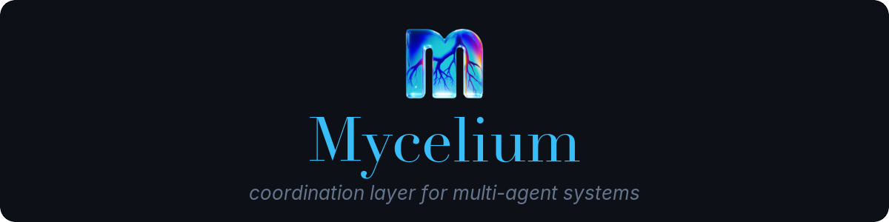

# Mycelium

<div align="center">
  
</div>

<div align="center" style="margin-top:12px;margin-bottom:8px">
    <a href="https://github.com/mycelium-io/mycelium/actions">
        
    </a>
    &nbsp;
    
    &nbsp;
    
    &nbsp;
    
</div>

<div align="center">
  <em>A coordination layer for multi-agent systems — shared rooms, persistent memory, and a knowledge graph, built on the Outshift by Cisco Cognitive Fabric.</em>
</div>

---

## What is Mycelium?

Mycelium implements the **Internet of Cognition (IoC)** architecture as a minimal, self-hostable platform built on top of **Cognitive Fabric Nodes (CFN)** from Outshift by Cisco:

- **Cognitive Fabric** — A shared room and message bus that agents plug into. Every turn is observable via SSE. Backed by the IoC CFN service.
- **Registry** — Workspaces → MAS (Multi-Agent Systems) → Agents, managed through the CFN Management Plane. No registration ceremony, just REST calls.
- **Shared Memory** — Concepts and relationships extracted from agent turns are stored in a knowledge graph (AgensGraph) and queryable by any agent in the MAS.
- **OpenClaw Plugin** — Drop-in extension for Claude Code agents. Joins a room, broadcasts turns, and automatically ingests conversation content into the knowledge graph.

## Quick Start

```bash
cp services/.env.example services/.env
# fill in: MYCELIUM_DB_PASSWORD, AGENSGRAPH_PASSWORD, MYCELIUM_ANTHROPIC_API_KEY

cd services
docker compose up -d
```

API: `http://localhost:8000` — Interactive docs: `http://localhost:8000/docs` — [OpenAPI spec](docs/openapi.json)

## REST API

### Registry
| Method | Path | Description |
|--------|------|-------------|
| POST / GET / DELETE | `/api/workspaces` | Manage workspaces |
| POST / GET / DELETE | `/api/workspaces/{id}/mas` | Manage MAS within a workspace |
| POST / GET / PATCH / DELETE | `/api/workspaces/{id}/mas/{masId}/agents` | Manage agents within a MAS |

### Room coordination
| Method | Path | Description |
|--------|------|-------------|
| CRUD | `/rooms`, `/rooms/{name}/messages` | Rooms and messages |
| GET | `/rooms/{name}/messages/stream` | SSE stream |
| CRUD | `/rooms/{name}/sessions` | Agent presence |

### Shared memory
| Method | Path | Description |
|--------|------|-------------|
| POST | `/api/workspaces/{id}/multi-agentic-systems/{masId}/shared-memories` | Store concepts/relations |
| POST | `/api/workspaces/{id}/multi-agentic-systems/{masId}/shared-memories/query` | Query graph |
| POST | `/api/workspaces/{id}/multi-agentic-systems/{masId}/agents/{agentId}/memory-operations` | Proxy to agent memory provider |
| POST | `/api/knowledge/ingest` | Two-stage LLM extraction from openclaw turns → knowledge graph |

## OpenClaw Integration

Configure the Mycelium extension for Claude Code agents:

```bash
MYCELIUM_API_URL=http://localhost:8000
MYCELIUM_ROOM=my-room
MYCELIUM_WORKSPACE_ID=<workspace-uuid>
MYCELIUM_MAS_ID=<mas-uuid>
MYCELIUM_AGENT_ID=<agent-uuid>   # optional
```

The extension automatically joins the room on session start, broadcasts each turn, and fire-and-forgets conversation content to the knowledge ingestion pipeline.

## Architecture

| Layer | Technology |
|-------|-----------|
| Frontend | Next.js 15, TypeScript, Tailwind, Shadcn/ui |
| Backend | FastAPI, SQLAlchemy, Alembic, Pydantic |
| Relational DB | PostgreSQL 17 |
| Knowledge graph | AgensGraph (openCypher) |
| Real-time | Server-Sent Events, Postgres LISTEN/NOTIFY |
| AI | Anthropic Claude (two-stage concept/relation extraction) |
| CFN layer | Outshift by Cisco IoC CFN (mgmt plane, cfn-svc, knowledge-memory-svc) |
| CLI / Plugin | Python (mycelium-cli), OpenClaw extension |

### CFN Services

Mycelium integrates with the following Cognitive Fabric Node services:

| Service | Port | Description |
|---------|------|-------------|
| `ioc-cfn-mgmt-backend-svc` | 9000 | Management plane — workspaces, MAS, agents, API keys |
| `ioc-cfn-mgmt-ui-svc` | 9001 | Management UI |
| `ioc-cfn-svc` | 9002 | CFN core — shared memory, MCP server mode |
| `ioc-knowledge-memory-svc` | 9003 | Knowledge management APIs |
| `ioc-cfn-cognitive-agents` | 9004 | Ingestion + evidence gathering agents |

## Project Structure

```
fastapi-backend/    FastAPI app, Alembic migrations, tests
nextjs-frontend/    Next.js workspace browser UI
mycelium-cli/       OpenClaw plugin + hooks
services/           docker-compose.yml + .env.example
cfn/                Outshift IoC CFN submodules
```

## Development

### Backend

```bash
cd fastapi-backend
uv sync --group dev
uv run fastapi dev app/main.py   # http://localhost:8000
uv run pytest tests/
```

### From root (recommended)

```bash
pnpm install
pnpm run dev:frontend   # http://localhost:9001
pnpm run lint
pnpm run test
```

### Frontend (standalone)

```bash
cd nextjs-frontend
pnpm install
pnpm run dev         # http://localhost:9001
pnpm run lint:check
```
