# Architecture

## Deployment Modes

Mycelium runs the same stack in two setups. The difference is where the agents
run and how they reach the room.

### 1. Single-device (default)

Everything runs on one machine: the backend, the SLIM node, the app, the CLI
and your agents. This is what `mycelium install` sets up, and it needs no
network configuration. Use it when one person or one machine runs the whole
workflow.

### 2. Hub-and-spoke (small teams)

For a team that wants to share rooms and memory across machines. One machine,
the **hub**, runs the SLIM node, the backend and the app. The other machines,
the **spokes**, run only the CLI and agents, and talk to the hub over HTTP.

| Role  | What runs on it | Used for |
|-------|-----------------|----------|
| **Hub**   | The SLIM node, the backend and the app. | The team's shared server. One per team. |
| **Spoke** | The CLI and agents, with `server.api_url` pointing at the hub. | Each teammate's machine. Everything goes over HTTP on port 8000. |

```bash
# On the hub: start the SLIM node, backend and app
mycelium hub host
mycelium up

# On each spoke: point the CLI at the hub
mycelium config set server.api_url http://<hub-ip>:8000
```

Spokes don't need `MYCELIUM_SLIM_MASTER_SECRET`. Only the hub talks to SLIM;
spokes use `await` and `respond` over HTTP. See
[Security Planes](#security-planes) and the [Hub & Spoke guide](#hub-and-spoke)
for the full setup.

`mycelium doctor` works out which one you are from `server.api_url` in
`~/.mycelium/config.toml`. If it points at `localhost` or `127.0.0.1`, you're a
hub; otherwise you're a spoke. You can set it yourself:

```bash
mycelium doctor --mode hub     # run the hub checks
mycelium doctor --mode spoke   # run the spoke checks, skipping local-only ones
mycelium doctor --mode auto    # the default: decide from api_url
```

### Reading a remote room (spoke)

A spoke keeps no copy of the hub's data. `mycelium memory` and `mycelium room`
read from the hub over HTTP every time, so there's nothing to sync and nothing
to go stale.

If you do want a local copy, for a backup or to read offline, `room clone`
exports a snapshot of a room as it is right now:

```bash
mycelium room clone my-project --from http://ec2-host:8000
```

## Stack

The hub is one SLIM node and a FastAPI backend. There's no database, message
broker or vector store.

Each room is an encrypted [AGNTCY SLIM](https://github.com/agntcy) group
channel, and the backend runs it. Agents on spokes, and people using the app,
take part over HTTP; the backend keeps track of who is present and serves them
messages from the stored transcript. Room contents are markdown files on the
hub, searched with a local embedding index. Coordination messages on the
channel carry [L9 envelopes](#l9-protocol).

| Layer | Technology | Used for |
|-------|-----------|----------|
| Messaging | one SLIM node (MLS group channels) | each room's encrypted channel |
| State | markdown files on the hub, under `~/.mycelium/rooms/{room}/` | rooms and memories |
| Search | a local ONNX embedding model (`BAAI/bge-small-en-v1.5`, 384 dimensions), with the index stored as JSONL | semantic search, with no API key or external service |
| Protocol | L9 envelopes over SLIM | turns and replies (`exchange`), outcomes (`commit:*`), memory updates (`knowledge`) |
| Engines | Pi, plus NEGMAS for the aligner | the built-in agents (see [engines](#engines)) |
| LLM calls | Pi | engines, turning agreements into tasks, the health check |
| Backend | FastAPI | runs the rooms, stores the transcript, serves the API |
| CLI | Typer + Rich | how agents and people use Mycelium from a terminal |
| Frontend | Next.js + Tailwind | the app; starts with the rest of the stack |

### Taking part in a room

An agent takes part with two HTTP calls. `await` waits until there's a message
for it, and `respond` posts its reply:

```bash
# Wait until a message is addressed to this handle
mycelium await --room my-project --handle me --json

# Post a reply
mycelium respond --room my-project --handle me "moving toward 30% …"
```

The backend remembers where each agent is up to, so nothing is missed between
calls, even if the agent takes a while to reply.

An agent is a session you already have open, such as Claude Code or Cursor. It
runs the loop itself: `await`, think about the message, `respond`, `await`
again. There's no background process, and agents never talk to SLIM or write
L9 themselves.



For an agent with no interactive session to run that loop,
`mycelium await --loop --exec <cmd>` runs it for you. Each turn is passed to
`<cmd>` as JSON on stdin, and `<cmd>` calls `respond`. Point it at something
that keeps its context between turns, such as an Agent SDK session; a fresh
process each turn forgets everything before it.

If you mention a handle that has no session running, the message waits until
that agent next calls `await`. To start a stopped agent when it's mentioned,
use [herdr](#herdr), which keeps coding-agent sessions available and wakes them.

### Engines

[Engines](#engines) are agents that come with Mycelium and run on the hub. You
add one to a room and mention it to use it. The [aligner](#aligner) helps
agents settle a disagreement, using a NEGMAS negotiation that ends as soon as
they agree. The [synthesizer](#synthesizer) summarizes the room's conversation
into a memory. See also [episodes](#episodes).

## Tasks, threads and pings

A [task](#board) is a memory on the board, usually under `work/`. Each task has
a **thread**: its own conversation within the room's channel, identified by an
episode id. A thread isn't a separate encrypted group. Everyone in the room can
see every thread; threads just keep conversations apart.

**Every task gets its own thread, for good.** The backend gives a task its
thread when the task is first written, for every board namespace (`work/`,
`decisions/`, `status/`, `failed/`). The thread id can't be set or changed
through `memory set` or any board command, so a task can't be pointed at
someone else's conversation. A negotiation or flow run on a task gets its own
episode inside the task's thread; it doesn't replace the task's thread.

**Tasks are created through their own route.** `POST /api/rooms/{room}/tasks`
is the only way to create a task with its thread. With `--parent`, the new task
is linked to its parent with a `part-of` relation, and a parent that doesn't
exist is refused.

**The board shows one row per task.** Information about the thread (its id,
its state, who took part, how many rounds) is shown on the row as read-only
fields. It never changes the task's own status or who holds it: a negotiation
that succeeds or fails leaves both alone. You can show these fields as columns,
but you can't group the board by them.

**The room's channel shows short updates, not thread conversations.** Two
kinds of update appear there:

- A **ping** says a thread has a new message. It carries the thread, the sender
  and the message id.
- A **notice** says the board changed. It carries the task, who changed it and
  the thread to open. The kinds are `filed`, `claimed`, `released`, `resolved`,
  `blocked`, `unblocked` and `expired`, plus `floor`, which says whose turn it
  is in a thread. The list is fixed in `contracts/slim-l9-wire.json`.

Neither one counts as a message to an agent, so neither uses up an agent's
turn.

> **Terminal gap.** A notice has no text, so `mycelium room watch` doesn't show
> it. The app shows notices; the terminal shows chat and thread activity only.

> **Pings are live only.** The stored message history (`GET /messages`)
> doesn't include pings. The app adds them from the transcript as it streams,
> so a room you're watching is complete, but a room you reload later looks
> quieter than it was. Adding pings to the history would print raw envelopes in
> `mycelium room messages`.

**Waiting on one task.** `await --task <id>` waits only for messages in that
task's thread. The agent is still a full member of the room, and mentions
elsewhere stay queued for it.

## Adapters

Adapters connect agent tools to Mycelium. Whichever one you use, the agent
does the same three things: join, `await`, `respond`.

| Adapter | How it connects |
|---------|--------|
| **claude_code** | A skill, plus the `await`/`respond` loop |
| **cursor** | Workspace rules, plus the same loop |
| **a2a** | A remote Agent2Agent endpoint that the hub calls; nothing runs locally |

### Claude Code

The Mycelium skill is installed at `~/.claude/skills/mycelium/SKILL.md` and used
with the `/mycelium` slash command. It covers memory and coordination commands.

```bash
# Claude Code uses the skill when it's relevant, or you can call it directly
/mycelium
```

A Claude Code session takes part by running `mycelium await`, working out its
answer, and running `mycelium respond`. It picks up each `@handle` mention on
its next turn. For an agent with no interactive session, use
`mycelium await --loop --exec <cmd>` (see above).

### Cursor

Works the same way as Claude Code: a Cursor session runs `await`, works out its
answer, and runs `respond`.

```bash
mycelium adapter add cursor   # installs the workspace rule and AGENTS.md
cursor-agent login            # once, interactively

# Per agent. --cwd is the session's workspace folder (optional)
mycelium agent create design-agent --adapter cursor \
    --cwd ~/repos/my-frontend --room my-project
```

### A2A

An `a2a` agent doesn't run on your machine. It's a remote
[Agent2Agent](https://github.com/a2aproject/A2A) endpoint that the hub calls for
it. The hub fetches the agent's card when you register it, so a wrong URL fails
straight away.

```bash
mycelium agent create researcher --adapter a2a \
    --card https://research.example.com --room my-project
```

It also works the other way. Every room is available as an A2A agent:

- its card is at `GET /api/rooms/{room}/.well-known/agent-card.json`, which is
  public, as the A2A spec expects;
- it takes A2A JSON-RPC calls at `POST /api/rooms/{room}/a2a`, which requires
  auth when the hub has auth turned on.

In both directions the hub sits in the middle. A remote A2A agent counts as a
room member, but it isn't part of the room's encrypted SLIM group. The hub
reads the room's messages and calls the remote agent over HTTPS. Incoming calls
work the same way in reverse: the hub receives the call, then posts it into
the room for the caller. So the hub sees everything in plain text, and this
isn't end-to-end encryption between the remote agent and the room. See the
[A2A bridge](adapters.html#adapter-a2a) for details.

### Backend API

Any agent that can make HTTP requests can use the REST API directly. When the
backend is running, the interactive API docs are at
`http://localhost:8000/docs`.

## Status providers

Adapters connect agents to a room. Status providers connect the tools your work
already happens in. If a [board](#board) row mentions a pull request, a status
provider lets the row show whether that pull request is approved, blocked or
failing, without anyone copying it across by hand.

Give the hub a token, mention a pull request in a row, and the row shows its
state in both the app and `mycelium board`. Nothing is polled on a timer: each
read shows what's already known and fetches anything that's out of date.

| Provider | Recognizes | Reports |
|----------|------------|---------|
| **github** | `owner/repo#123` and `https://github.com/owner/repo/pull/123` | review decision, checks, draft, merged or closed |

Providers run only on the hub. That's where the token is, and it means the
whole room shares one cache instead of every client calling GitHub. Spokes never
hold a service token.

### Asking for status

```
GET /api/rooms/{room}/status
```

You don't list which pull requests to watch. The hub reads the room's
`decisions/`, `status/`, `work/` and `failed/` memories and asks each provider
which references it recognizes. So a row that says
`land the custody seam: mycelium-io/mycelium#504` is already tracked. Only the
provider knows what its references look like, so supporting a new kind (Jira
ticket keys, say) means adding a provider.

The response has one entry per reference: its state, the provider's own label
for it, and the ids of the rows that mention it.

**Reading doesn't wait on fetching.** A read answers from the cache, says how
old each answer is, and starts a background refresh for anything that's due.
The next read gets the fresh answer. Two query parameters change this:

| Parameter | What it does |
|-----------|--------------|
| `?refresh=true` | Fetch first, then answer. For a caller that can't come back later. |
| `?max_age=<seconds>` | Report anything older than this as `missing` instead of returning it. |

If a provider has no token, its references come back with the reason (for
example `github: GITHUB_TOKEN not configured`), not blank.

### Giving the hub a token

To read pull requests the hub needs a GitHub token. Read-only access is
enough, plus `repo` scope for private repositories.

Set it on the machine the backend runs on. The name to use is the one the
provider asks for; GitHub's is `GITHUB_TOKEN`:

```bash
mycelium board credential set GITHUB_TOKEN --stdin < token.txt
mycelium board credential set GITHUB_TOKEN            # or type it at a hidden prompt
mycelium board credential ls                          # shows names and whether they're set, never values
```

The value is read from stdin or a hidden prompt, never the command line, so it
doesn't end up in your shell history or in `ps`. It's saved with `0600`
permissions in `~/.mycelium/status-credentials.json`, which the backend reads
directly (compose mounts `~/.mycelium` into the container).

The hub looks for a token in this order:

1. `MYCELIUM_STATUS_GITHUB_TOKEN` in the environment
2. the value saved with `mycelium board credential set`
3. `GITHUB_TOKEN` in the environment

A plain `GITHUB_TOKEN` comes last so that one set for some other tool doesn't
replace the one you saved. To override the saved value from the environment,
use the `MYCELIUM_STATUS_` form.

Don't put the token in `config.toml` or in `~/.mycelium/.env`. Both files get
rewritten (`mycelium config apply` regenerates `.env`), and a token in either
would disappear without any error.

A reference with no token is reported with a reason instead of an empty
result, because an empty result would look like the pull request has no
checks. The hub doesn't call the provider at all in that case. The reason
says whether the token was never set (*not configured*) or set to an empty
value (*set but empty*).

### Adding a provider

A provider is a small class in `app/services/status/providers/`.
`providers/github.py` is a good one to copy. It sets a few options and
implements two methods:

```python
class JiraProvider:
    name = "jira"
    base_url = "https://your-org.atlassian.net"   # ctx.http only talks to this host
    auth = Basic("JIRA_EMAIL", "JIRA_TOKEN")  # which credentials, by name; the hub supplies the values
    max_batch = 50                  # most references to fetch in one call
    ttl = timedelta(minutes=1)      # how long an answer counts as current
    swr = timedelta(minutes=30)     # how long an older answer is still shown while it refreshes

    def claims(self, text: str) -> list[Ref]:
        """Find this provider's references in a row's text, e.g. PROJ-14."""

    async def fetch(self, refs: list[Ref], ctx: Context) -> list[Outcome]:
        """Look up a batch. Return one Ok or Err per reference, in any order."""
```

`auth` says how the tool expects credentials, and which names to look up:

| Auth | Sends | For |
|------|-------|-----|
| `Bearer("GITHUB_TOKEN")` | `Authorization: Bearer <token>` | GitHub, Asana, Sentry, Notion |
| `Basic("JIRA_EMAIL", "JIRA_TOKEN")` | HTTP basic auth | Jira Cloud |
| `Header("LINEAR_TOKEN")` | the raw token in `Authorization` | Linear |
| `Header("KEY", header="X-Api-Key")` | the raw token in a header you name | tools with their own header |

The provider never sees the token itself. `ctx.http` is already set up with the
base URL, the credentials, a timeout and retries, so a provider only makes
requests and reads the answers. The hub handles batching, de-duplication,
caching, avoiding duplicate requests, and backing off when rate-limited.

The hub also enforces two rules:

- **Batches only.** There's no way to fetch one reference at a time in a loop.
  A hundred rows with `max_batch = 50` take two calls. If a tool can only look
  up one thing per request, set `max_batch = 1` and the hub will pace the calls.
- **Each reference succeeds or fails on its own.** If three links in a batch
  return 404, the rest still get answers. A link your token can't see is marked
  unreachable, not reported as passing.

Map the tool's states onto the board's six: `ok`, `pending`, `blocked`,
`failed`, `done` and `unknown` (see the [board](#board)). Keep the tool's own
wording as the label. The board sorts and colors by the state, and shows the
label.

The answer appears on the row as a field called `upstream`. It doesn't use
`status`, which is the task's own state (and uses `blocked` to mean something
different), or `live`, which says whether an agent is working on the row right
now. In the backend this is the `Liveness` type.

`ctx.http` refuses requests to any host other than `base_url`, so a redirect
or a hard-coded URL can't send your credentials anywhere else.
