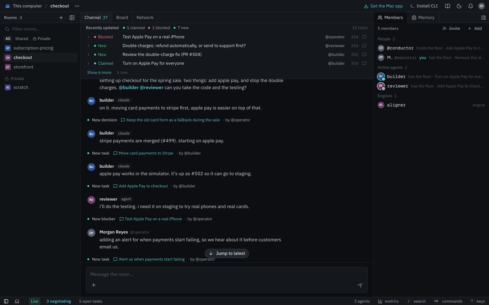

<!-- SPDX-License-Identifier: Apache-2.0 -->
<!-- Copyright 2026 Mycelium Contributors -->

# mycelium-deck: the slide template

A slide deck in plain HTML, for talks and workshops. It uses the docs' palette
and type (Cormorant Garamond italic for display, IBM Plex Sans, Geist Mono).
The background is new: instead of a field of glass droplets, one glass lens
moves across a mycelial network. The network keeps growing for as long as the
deck is open, and pulses run along its hyphae. The lens magnifies whatever is
under it, and it moves from slide to slide like a drop of gel, stretching
along its path.

## Presenting

Open `index.html` in Chrome. There is no build step and no server. It needs
`../docs/` beside it for the logo and screenshots, and the internet for the
fonts. Without a connection the type falls back to Georgia and system fonts.

| Key | |
|---|---|
| → Space PageDown | next step, then next slide (clickers send these) |
| ← PageUp | back |
| O | overview of every slide; click a tile to jump to it |
| S | speaker view: notes, what comes next, elapsed time, the clock |
| F | fullscreen |
| T | light / dark (light suits a bright room or a weak projector) |
| B or . | blackout |
| a number, then ⏎ | go to that slide |
| ? | the key list |

## Live terminals

```bash
uv run mycelium-deck/serve.py --cwd ~/workshop
```

This serves the deck at `http://127.0.0.1:8765/mycelium-deck/index.html?token=…`
and opens it. Each terminal pane is then a real shell: bash with a plain
prompt, started in `--cwd`, running as you with your environment, so
`mycelium` there is your own CLI talking to your own hub. `--login` gives
you your own shell and prompt instead. Each terminal keeps its shell while
the server runs, and a reload replays what was on it.

- Each press of → types the pane's next prepared command and runs it, one
  per press, before the deck moves on. That way the demo goes as rehearsed,
  with no typos.
- Click into a terminal to type yourself. The keys go to the shell until you
  press Esc, which hands them back to the deck (Esc never reaches the shell).
- The speaker view counts the commands left.
- Opened as a file, or without the server, every terminal is the static one
  it was written as.

The server listens on 127.0.0.1 only. Terminal requests must carry the
token from the URL, come to that host by name and, from a browser, from
that origin, so no other page can type into a shell. It needs Python 3.10+
and nothing else, on macOS or Linux. xterm.js loads from jsDelivr.

To make a pane live, give it a `data-term` id and a script:

```html
<div class="term pane" data-term="board">
  <div class="bar"><i></i><i></i><i></i><span>room · passkeys</span></div>
  <template class="script">
    mycelium board new "Ship passkey login"
    mycelium board
  </template>
  <pre>…what it shows without the server…</pre>
</div>
```

## The live app

An app pane shows the real Mycelium app in a frame:

```html
<div class="app pane" data-app="/room/workshop" data-zoom="1.1">
  <div class="bar"><i></i><i></i><i></i><span class="addr">mycelium</span></div>
  <div class="app-view"></div>
  <template class="script">
    /room/workshop/graph
    /metrics
  </template>
</div>
```

- **Finding the app.** The deck looks for it at `?app=` on its own URL
  (`serve.py --app URL` adds that), else on the Docker stack's port
  (`127.0.0.1:8080`), else the Mac app's (`127.0.0.1:3717`). Until one
  answers, the pane shows its screenshot, so the slide works offline and as
  a file.
- **Clicking in.** The frame sits under a shield. Click it to use the app,
  and click anywhere else on the slide to give the keys back to the deck.
  A frame with focus keeps every key, a clicker's included.
- **Stepping through pages.** Each → opens the next route in the script,
  after any terminal commands on the slide. The speaker view counts the
  pages left.
- **Zoom.** `data-zoom` enlarges the app inside the frame, so the room can
  read it.

The app keeps its own theme, whatever the deck's. Present from the app
`mycelium up` or the Mac app serves: a `next dev` server draws its own
error badge over the page.

The URL hash is the slide number (`index.html#7`). To make a PDF, print from
Chrome with background graphics on. Each slide prints as one 1920×1080 page
with a still lens drawn in CSS.

## Writing slides

Each slide is a `<section class="slide">` on a 1920×1080 stage. Lay slides
out in stage pixels and the deck scales them to fit the screen.

```html
<section class="slide" data-title="Agenda" data-lens="1600 600 250">
  <span class="kicker rise">The next 90 minutes</span>
  <h2 class="rise">Agenda</h2>
  …
  <aside class="notes"><p>Shown in the speaker view.</p></aside>
</section>
```

- `data-lens="x y r"` is where the lens sits and how big it is, in stage
  pixels. Give up to three, separated by commas (`"1520 470 330, 1130 860 54"`
  is a lens with a bead beside it), or `none`.
- `data-title` names the slide in the tab and the speaker view.
- `data-bare` hides the footer. On the `.deck` itself, `data-talk` names the
  talk in the tab and the speaker view, and `data-footer` puts a line in the
  middle of every footer.
- `.rise` elements arrive one after another when their slide opens.
- `.step` elements are revealed one per key press before the deck moves on. A
  step with its own `data-lens` moves the lens while it is the latest one shown.
- `.pane` is frosted glass. Use it for anything that sits over the lens.
- `<div class="timer" data-minutes="10" style="--x:1500px; --y:560px">` is a
  countdown centred on that point: click to start or pause, double-click to
  reset. The exercise slide centres one on its lens.

The sample deck has one slide for each layout: `layout-title`, a terminal
(`layout-terminal`), an agenda (`.agenda`), `layout-section`,
`layout-statement`, `.cards`, `layout-diagram` (an SVG in stage coordinates
with the lens over its centre), a flow of `.step`s, `.numbers`,
`layout-exercise` with a timer, `layout-image`, `layout-app` (the live app), `.compare` and `layout-close`.
Copy the one closest to what you need.

## Files

| | |
|---|---|
| `index.html` | the slides |
| `deck.css` | palette (dark, and light under `data-theme="light"`), type, layouts, print |
| `deck.js` | fitting the stage, keys, steps, overview, speaker view, timers |
| `lens.js` | the background: grows the network on a 2D canvas, then draws it with the lens in one WebGL shader |
| `term.js` | live terminals: xterm.js panes over the shells `serve.py` runs |
| `app.js` | live app panes: the Mycelium app in a frame, its screenshot until it answers |
| `serve.py` | serves the deck on 127.0.0.1 and runs a shell on a pseudo-terminal per pane |

With `prefers-reduced-motion`, the network is drawn once and the lens jumps
between positions. Without WebGL, the CSS lens from print is used on screen.
